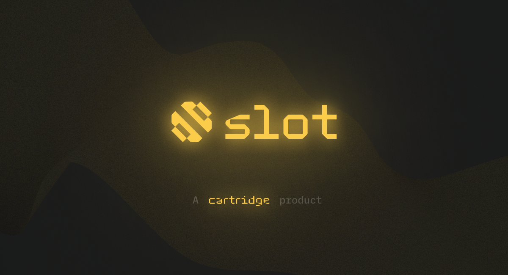

# Slot

A toolchain for rapidly spinning up Katana and Torii instances. Play test your game in seconds.

## Installation

Install `slotup` to manage slot installations and follow the outputted directions.
```
curl -L https://slot.cartridge.sh | bash
```

## Usage

Authenticate with Cartridge
```sh
slot auth login
```

Create service deployments
```sh
slot deployments create <Project Name> katana
slot deployments create <Project Name> madara
slot deployments create <Project Name> torii --world 0x3fa481f41522b90b3684ecfab7650c259a76387fab9c380b7a959e3d4ac69f
```

Update a service
```sh
slot deployments update <Project Name> torii --version v0.3.5
```

Delete a service
```sh
slot deployments delete <Project Name> torii
```

Read service logs
```sh
slot deployments logs <Project Name> <katana | madara | torii>
```

List all deployments
```sh
slot deployments list
```

View deployments configuration
```sh
slot deployments describe <Project Name> <katana | madara | torii>
```

View predeployed accounts
```sh
slot deployments account <Project Name> katana
```